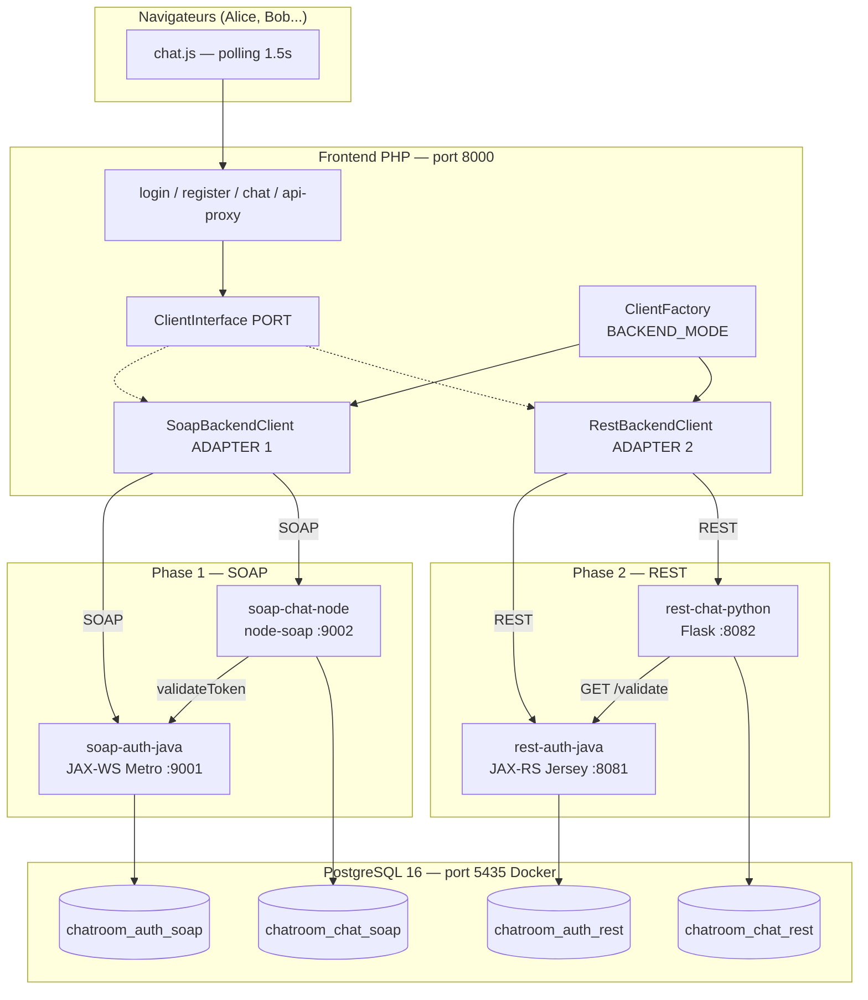

# Architecture du FINAL_PROJECT — description complète

Document de référence pour comprendre **l'ensemble** du projet : pourquoi telle techno, quel pattern, comment ça s'articule. Conçu pour être lu linéairement (du début à la fin) ou par section indépendante via le sommaire.

Pour le démarrage opérationnel, voir [`../README.md`](../README.md).
Pour les flux temporels message-par-message, voir [`./sequence.md`](./sequence.md).

---

## Sommaire

1. [Contexte et objectifs pédagogiques](#1-contexte-et-objectifs-pédagogiques)
2. [Vue d'ensemble](#2-vue-densemble)
3. [Stack technique justifiée](#3-stack-technique-justifiée)
4. [Pattern Port + 2 Adapters](#4-pattern-port--2-adapters)
5. [Modèle de données](#5-modèle-de-données)
6. [Authentification et tokens](#6-authentification-et-tokens)
7. [Composition de services — le cœur du TP](#7-composition-de-services--le-cœur-du-tp)
8. [Content negotiation REST (JSON + XML)](#8-content-negotiation-rest-json--xml)
9. [Polling côté navigateur](#9-polling-côté-navigateur)
10. [Bascule SOAP ↔ REST](#10-bascule-soap--rest)
11. [Référence aux autres documents](#11-référence-aux-autres-documents)
12. [Points pédagogiques clés](#12-points-pédagogiques-clés)
13. [Limites et évolutions possibles](#13-limites-et-évolutions-possibles)

---

## 1. Contexte et objectifs pédagogiques

Le **FINAL_PROJECT** clôture le module **Web Services** du cursus **DIC3 2026 (ESP DGI)**. Il prolonge la progression du cours :

| TP | Paradigme | Stack | Communication |
|---|---|---|---|
| **TP0** | Callback synchrone | Java RMI | Server push via `MessageListener` distant |
| **TP1** | Polling + dual-channel | Java XML-RPC | Pull périodique + bidirectionnel sur 2 ports |
| **FINAL_PROJECT** | SOAP **puis** REST | Polyglotte (Java/Node/Python/PHP) | Composition de microservices |

Ce que le projet **démontre concrètement** :

1. **Deux protocoles** de services web sur le même cas métier :
   - **SOAP** (contrat WSDL, enveloppes XML)
   - **REST** (ressources, verbes HTTP, content negotiation **JSON + XML**)
2. **Composition de services autonomes** : `AuthService` et `ChatService` sont deux processus séparés, sur deux bases séparées, qui communiquent **via le protocole de la phase** (et non via la base).
3. **Interopérabilité polyglotte réelle** : trois langages (Java, Node.js, Python) qui dialoguent via des contrats standardisés.
4. **Pattern hexagonal côté client** : le frontend PHP applique le pattern **Port + Adapters** pour basculer entre les deux phases sans toucher au code applicatif.

---

## 2. Vue d'ensemble

### Diagramme global



### Tableau des composants

| Composant | Techno | Port | Rôle | Base |
|---|---|---|---|---|
| **frontend-php** | PHP 8.4 + Apache CLI | 8000 | UI + adapter SOAP/REST | — |
| **soap-auth-java** | Java 21 / JAX-WS Metro | 9001 | Auth + sessions (phase SOAP) | `chatroom_auth_soap` |
| **soap-chat-node** | Node.js / node-soap | 9002 | Rooms + messages (phase SOAP) | `chatroom_chat_soap` |
| **rest-auth-java** | Java 21 / JAX-RS Jersey + Grizzly | 8081 | Auth + sessions (phase REST) | `chatroom_auth_rest` |
| **rest-chat-python** | Python 3.13 / Flask + xmltodict | 8082 | Rooms + messages (phase REST) | `chatroom_chat_rest` |
| **postgres** | PostgreSQL 16 (Alpine, Docker) | 5435 → 5432 | Persistance (4 bases) | — |

**Choix d'infrastructure** : **Docker n'est utilisé que pour PostgreSQL.** Les 4 services applicatifs tournent en local (process natifs Java/Node/Python/PHP) — c'est plus simple à déboguer dans un IDE et plus pédagogique (on voit chaque service démarrer dans son terminal).

---

## 3. Stack technique justifiée

Chaque composant a été choisi selon trois critères : **cohérence pédagogique** (rester proche des TPs précédents quand possible), **interopérabilité polyglotte** (montrer que le protocole est standardisé), et **simplicité de mise en œuvre** (l'étudiant doit pouvoir lire le code en une soirée).

### 3.1 AuthService SOAP — Java 21 / JAX-WS Metro

**Pourquoi** : continuité avec TP0 (Java RMI) et TP1 (Java XML-RPC). JAX-WS est l'API standard Jakarta pour SOAP. **Metro** est l'implémentation de référence (issue d'Oracle puis Eclipse) — JAX-WS a été retiré du JDK depuis Java 11, il faut donc l'embarquer en jars (`com.sun.xml.ws:jaxws-rt`).

**Fichiers clés** :
- `soap/auth-service/src/esp/dgi/ws/soap/auth/api/AuthService.java` — interface `@WebService`
- `soap/auth-service/src/esp/dgi/ws/soap/auth/server/AuthServiceImpl.java` — implémentation
- `soap/auth-service/src/esp/dgi/ws/soap/auth/server/ServerApp.java` — `Endpoint.publish(...)`

**Bootstrap** :
```java
String address = "http://0.0.0.0:" + port + "/auth";
Endpoint.publish(address, new AuthServiceImpl());
```
WSDL servi automatiquement sur `?wsdl`. Pas de serveur d'application, pas de Tomcat — un simple `java -cp ... ServerApp`.

### 3.2 ChatService SOAP — Node.js / node-soap

**Pourquoi** : démontrer l'**interopérabilité polyglotte** (un service SOAP n'est pas forcément en Java). `node-soap` (v1.x) est la lib SOAP la plus mature de l'écosystème Node, activement maintenue.

**Particularité** : approche **contract-first** — le WSDL est écrit à la main (`soap/chat-service/wsdl/chat.wsdl`) puis l'implémentation Node respecte ce contrat. C'est l'**opposé** de JAX-WS qui est code-first (WSDL auto-généré).

**Fichiers clés** :
- `soap/chat-service/wsdl/chat.wsdl` — contrat (XML)
- `soap/chat-service/src/service.js` — implémentation des 4 opérations
- `soap/chat-service/src/authClient.js` — client SOAP **sortant** vers Java
- `soap/chat-service/src/app.js` — `soap.listen(app, '/chat', services, wsdl)` mount sur Express

### 3.3 AuthService REST — Java 21 / Jersey + Grizzly

**Pourquoi** : Jersey est l'**implémentation de référence de JAX-RS** (Jakarta REST API). Grizzly est un serveur HTTP embarqué léger qui évite de monter un Tomcat. Le tout démarre en `~20` lignes avec `GrizzlyHttpServerFactory.createHttpServer(URI, ResourceConfig)`.

**Avantage pédagogique** : la content negotiation JSON ↔ XML est **déclarative** :
```java
@Produces({ MediaType.APPLICATION_JSON, MediaType.APPLICATION_XML })
public TokenInfoDTO validate(...) { ... }
```
Jersey choisit le format selon `Accept` ; Jackson gère le JSON, JAXB gère le XML (via `@XmlRootElement` sur les DTOs).

**Fichiers clés** :
- `rest/auth-service-java/src/esp/dgi/ws/rest/auth/server/resources/AuthResource.java`
- `rest/auth-service-java/src/esp/dgi/ws/rest/auth/server/Main.java`
- `rest/auth-service-java/src/esp/dgi/ws/rest/auth/api/dto/*.java` — DTOs `@XmlRootElement`

**Dépendances jars** dans `lib/` (résolues via `pom-deps.xml` + `mvn dependency:copy-dependencies`) :
- Jersey 3.1.8 (container-grizzly2-http, server, common, hk2, media-jaxb, media-json-jackson)
- JAXB runtime 4.0.5 (sinon le content negotiation XML retourne du vide)
- PostgreSQL JDBC 42.7, jBCrypt 0.4

### 3.4 ChatService REST — Python 3 / Flask + xmltodict

**Pourquoi** : démontrer **un autre langage** côté REST. Flask est le micro-framework Python le plus pédagogique — pas de magie cachée, pas d'ORM imposé. Pour la negotiation XML, `xmltodict` convertit un `dict` Python en XML en une ligne.

**Particularité** : content negotiation **explicite** (à la différence de JAX-RS) :
```python
best = request.accept_mimetypes.best_match(
    ['application/json', 'application/xml'],
    default='application/json')
if best == 'application/xml':
    return Response(xmltodict.unparse({'response': payload}), mimetype='application/xml')
return jsonify(payload)
```

**Fichiers clés** :
- `rest/chat-service-python/chatroom_chat/routes/{rooms,messages}.py` — routes Flask
- `rest/chat-service-python/chatroom_chat/clients/auth_client.py` — appel REST sortant vers Java
- `rest/chat-service-python/chatroom_chat/middleware/auth_middleware.py` — décorateur `@require_auth`
- `rest/chat-service-python/chatroom_chat/http/response.py` — `render()` qui fait la négociation

### 3.5 Frontend — PHP 8.4

**Pourquoi** : PHP a un **client SOAP natif** (`SoapClient`, extension `ext-soap`) très simple à utiliser. cURL est aussi natif (`ext-curl`). Le serveur de dev intégré (`php -S`) évite de monter Apache. Faible barrière d'entrée pour un étudiant.

**Fichiers clés** :
- `frontend-php/src/Client/ClientInterface.php` — le **port**
- `frontend-php/src/Client/SoapBackendClient.php` — adapter SOAP
- `frontend-php/src/Client/RestBackendClient.php` — adapter REST
- `frontend-php/src/ClientFactory.php` — sélection par `BACKEND_MODE`
- `frontend-php/public/*.php` — pages utilisateur

### 3.6 PostgreSQL 16 (Docker)

**Pourquoi** : choix arbitraire mais cohérent (le projet aurait pu utiliser MySQL, MariaDB, SQLite). PostgreSQL Alpine est léger (~80 Mo), supporte parfaitement `SERIAL`/`BIGSERIAL` (auto-increments natifs) et les types temporels avec précision milliseconde.

**Configuration** : `docker-compose.yml` mappe `5435:5432` (le port hôte 5432 est occupé par un autre container externe au projet). Les 4 services lisent `DB_PORT=5435` en variable d'environnement, avec une **valeur par défaut** déjà fixée à `5435` dans le code pour fonctionner sans configuration.

---

## 4. Pattern Port + 2 Adapters

### 4.1 Définition

Le pattern **Ports & Adapters** (alias **Hexagonal Architecture**, Alistair Cockburn 2005) consiste à :

1. Définir une **interface métier abstraite** (le *port*) qui exprime **ce que** l'application veut faire.
2. Fournir une ou plusieurs **implémentations concrètes** (les *adapters*) qui décrivent **comment** se connecter à un système externe précis.
3. Le code applicatif (les pages) **ne dépend que du port**, jamais d'un adapter en particulier.

Ce pattern est l'**inversion de dépendance** appliquée aux clients de services externes : on inverse la flèche habituelle "page → SoapClient" en "page → ClientInterface ← SoapBackendClient".

### 4.2 Mise en œuvre dans le projet

#### Le port

```php
// frontend-php/src/Client/ClientInterface.php
interface ClientInterface
{
    public function register(string $username, string $password): string;
    public function login(string $username, string $password): string;
    public function logout(string $token): bool;
    public function validateToken(string $token): array;
    public function listRooms(string $token): array;
    public function createRoom(string $token, string $name): array;
    public function sendMessage(string $token, int $roomId, string $content): int;
    public function getMessages(string $token, int $roomId, int $sinceId): array;
}
```

Sept méthodes métier, **sans aucune référence à SOAP ou REST**.

#### L'adapter SOAP (Phase 1)

```php
// frontend-php/src/Client/SoapBackendClient.php (extrait)
final class SoapBackendClient implements ClientInterface
{
    private SoapClient $auth;
    private SoapClient $chat;

    public function __construct(string $authWsdl, string $chatWsdl) {
        $opts = ['trace' => 1, 'exceptions' => true, 'cache_wsdl' => WSDL_CACHE_NONE];
        $this->auth = new SoapClient($authWsdl, $opts);
        $this->chat = new SoapClient($chatWsdl, $opts);
    }

    public function sendMessage(string $token, int $roomId, string $content): int {
        $r = $this->chat->sendMessage(['token'=>$token,'roomId'=>$roomId,'content'=>$content]);
        return (int) ($r->messageId ?? 0);
    }
    // ... idem pour les autres méthodes
}
```

#### L'adapter REST (Phase 2)

```php
// frontend-php/src/Client/RestBackendClient.php (extrait)
final class RestBackendClient implements ClientInterface
{
    public function __construct(
        private readonly string $authBase,
        private readonly string $chatBase,
    ) {}

    public function sendMessage(string $token, int $roomId, string $content): int {
        $r = $this->json('POST', $this->chatBase . "/rooms/{$roomId}/messages",
                         $token, ['content' => $content]);
        return (int) ($r['id'] ?? 0);
    }
    // ... cURL avec Authorization: Bearer
}
```

#### Le sélecteur

```php
// frontend-php/src/ClientFactory.php
final class ClientFactory
{
    public static function make(): ClientInterface
    {
        return match (BACKEND_MODE) {
            'soap' => new SoapBackendClient(SOAP_AUTH_WSDL, SOAP_CHAT_WSDL),
            'rest' => new RestBackendClient(REST_AUTH_BASE, REST_CHAT_BASE),
        };
    }
}
```

#### L'utilisation

```php
// frontend-php/public/api-proxy.php (extrait)
$client = ClientFactory::make();
$id = $client->sendMessage($_SESSION['token'], $roomId, $content);
echo json_encode(['id' => $id]);
```

**Aucune référence à SOAP, à `SoapClient`, à cURL ou à HTTP** dans `api-proxy.php`. Le jour où on ajouterait une phase 3 (gRPC, GraphQL...), il suffirait d'écrire un troisième adapter et d'ajouter un cas au `match`.

### 4.3 Bénéfices

- **Bascule indolore** : changer `BACKEND_MODE=soap` ↔ `BACKEND_MODE=rest` ne touche aucune ligne de code applicatif.
- **Isolation des pages** : le développeur des pages n'a pas à comprendre SOAP ni REST.
- **Testabilité** : on pourrait écrire un `FakeBackendClient` pour les tests unitaires.

---

## 5. Modèle de données

### 5.1 Quatre bases isolées

```
PostgreSQL
├── chatroom_auth_soap     ← AuthService SOAP
│   ├── users
│   └── sessions
├── chatroom_chat_soap     ← ChatService SOAP
│   ├── rooms
│   └── messages
├── chatroom_auth_rest     ← AuthService REST
│   ├── users
│   └── sessions
└── chatroom_chat_rest     ← ChatService REST
    ├── rooms
    └── messages
```

**Justification** :
- **Une base par service** : chaque microservice possède exclusivement ses données. Pas de FK cross-service, pas de couplage par la base. Un service peut être réécrit ou redémarré sans affecter l'autre.
- **Une base par phase** : isolation totale entre SOAP et REST. Les comptes créés en SOAP n'existent pas en REST — c'est volontaire (on démontre deux phases indépendantes).

Les scripts d'initialisation sont dans `database/init/*.sql`, exécutés automatiquement par PostgreSQL au premier démarrage via le volume `/docker-entrypoint-initdb.d/`.

### 5.2 Tables auth (`users` + `sessions`)

```sql
CREATE TABLE users (
  id            SERIAL PRIMARY KEY,
  username      VARCHAR(50) NOT NULL UNIQUE,
  password_hash VARCHAR(255) NOT NULL,            -- bcrypt $2a$...
  created_at    TIMESTAMP NOT NULL DEFAULT CURRENT_TIMESTAMP
);

CREATE TABLE sessions (
  token       CHAR(64) PRIMARY KEY,               -- SecureRandom hex 32 bytes
  user_id     INTEGER NOT NULL REFERENCES users(id) ON DELETE CASCADE,
  created_at  TIMESTAMP NOT NULL DEFAULT CURRENT_TIMESTAMP,
  expires_at  TIMESTAMP NOT NULL                  -- TTL 8 heures
);
CREATE INDEX sessions_user_id_idx ON sessions(user_id);
```

### 5.3 Tables chat (`rooms` + `messages`)

```sql
CREATE TABLE rooms (
  id          SERIAL PRIMARY KEY,
  name        VARCHAR(80) NOT NULL UNIQUE,
  created_by  INTEGER NOT NULL,                   -- user_id opaque (pas de FK)
  created_at  TIMESTAMP NOT NULL DEFAULT CURRENT_TIMESTAMP
);

CREATE TABLE messages (
  id          BIGSERIAL PRIMARY KEY,              -- monotone, sert au polling
  room_id     INTEGER NOT NULL REFERENCES rooms(id) ON DELETE CASCADE,
  user_id     INTEGER NOT NULL,                   -- opaque, vient d'AuthService
  username    VARCHAR(50) NOT NULL,               -- dénormalisé, voir 5.4
  content     TEXT NOT NULL,
  created_at  TIMESTAMP(3) NOT NULL DEFAULT CURRENT_TIMESTAMP
);
CREATE INDEX messages_room_id_idx ON messages(room_id, id);
```

### 5.4 Choix de design

#### `username` dénormalisé dans `messages`

Le `username` est **stocké en double** : dans `chatroom_auth_*.users.username` et dans `chatroom_chat_*.messages.username`. C'est une dénormalisation **volontaire**.

**Raison** : sans cette dénormalisation, chaque `getMessages` devrait, pour chaque message, rappeler AuthService pour traduire `user_id → username`. Soit N appels SOAP/REST pour N messages. Avec la dénormalisation, on résout le username **une fois au moment du `sendMessage`** et on le stocke.

**Compromis** : si un utilisateur change son `username`, les anciens messages garderont l'ancien (le projet ne propose pas cette fonctionnalité, mais le design le supporterait avec un script de migration).

#### `BIGSERIAL` sur `messages.id`

Choix d'un identifiant **monotone strictement croissant** pour permettre le polling incrémental :
```sql
SELECT * FROM messages WHERE room_id = ? AND id > :sinceId ORDER BY id
```

**Pourquoi pas un `created_at` ?** Parce que les horloges entre services peuvent différer (surtout en conteneurs/VMs). Un `BIGSERIAL` garantit l'ordre strict et l'unicité.

#### Pas de FK inter-base

`messages.user_id` n'a **pas de contrainte foreign key** vers `users.id` — parce que les deux tables sont dans des bases différentes (`chatroom_chat_*` vs `chatroom_auth_*`). PostgreSQL ne supporte pas les FK cross-database de toute façon.

C'est cohérent avec le principe **"chaque service est propriétaire de ses données"** : ChatService traite `user_id` comme un identifiant opaque obtenu via AuthService.

---

## 6. Authentification et tokens

### 6.1 Cycle de vie d'un token

```
register(u, p) ────► AuthService                        ┐
                       1. password_hash via jBCrypt     │
                       2. INSERT INTO users             │ → token
                       3. generate token (32 bytes hex) │
                       4. INSERT INTO sessions          ┘

login(u, p) ────────► AuthService
                       1. SELECT user WHERE username    ┐
                       2. BCrypt.checkpw(p, hash)       │ → token
                       3. generate token + INSERT       ┘

validateToken(t) ───► AuthService                       ┐
                       1. SELECT FROM sessions          │ → {userId, username}
                       2. SELECT FROM users             ┘   ou 401

logout(t) ──────────► AuthService
                       DELETE FROM sessions
```

### 6.2 Hashage bcrypt

Côté Java (SOAP et REST), `org.mindrot:jbcrypt:0.4` :
```java
public static String hash(String password) {
    return BCrypt.hashpw(password, BCrypt.gensalt(10));
}
public static boolean verify(String password, String hash) {
    return BCrypt.checkpw(password, hash);
}
```

Le coût `10` (cost factor) donne ~80 ms par hash, ce qui est acceptable pour un TP (login pas spammé). `gensalt()` ajoute un sel cryptographique unique par mot de passe, stocké dans le hash lui-même (`$2a$10$<salt><hash>`).

### 6.3 Génération du token

```java
// SessionDao.java
private static final SecureRandom RNG = new SecureRandom();

private static String generateToken() {
    byte[] bytes = new byte[32];     // 256 bits
    RNG.nextBytes(bytes);
    StringBuilder sb = new StringBuilder(64);
    for (byte b : bytes) sb.append(String.format("%02x", b));
    return sb.toString();             // 64 hex chars
}
```

64 caractères hexadécimaux = 256 bits d'entropie. Suffisant pour rendre le brute-force impossible. `SecureRandom` est un PRNG cryptographique (bloc `/dev/urandom` sous Linux).

### 6.4 Transport du token

| Phase | Mécanisme | Exemple |
|---|---|---|
| **SOAP** | Premier paramètre de la méthode | `chat.sendMessage(token, roomId, content)` |
| **REST** | En-tête HTTP standard | `Authorization: Bearer <64-hex-chars>` |

Choix SOAP : le token en paramètre (plutôt qu'en SOAP header) est plus simple à manipuler côté PHP `SoapClient` et garde une signature symétrique avec REST.

---

## 7. Composition de services — le cœur du TP

C'est **la** notion principale du projet. Sans elle, on aurait juste deux services qui parlent à la même base — peu intéressant.

### 7.1 Le problème

`ChatService` doit savoir qui envoie un message pour stocker `(user_id, username)`. Mais il **n'a pas** la table `users` dans sa base.

**Solution naïve (à ne pas faire)** : partager la base entre AuthService et ChatService. Couplage fort, casse l'autonomie.

**Solution adoptée** : ChatService **appelle AuthService** à chaque opération, via le protocole de la phase. C'est de la **composition de services distribués**.

### 7.2 Phase SOAP — Node → Java

```js
// soap/chat-service/src/authClient.js
const soap = require('soap');
const AUTH_WSDL = process.env.AUTH_WSDL || 'http://localhost:9001/auth?wsdl';

let clientPromise = null;
function client() {
  if (!clientPromise) {
    clientPromise = soap.createClientAsync(AUTH_WSDL);
  }
  return clientPromise;
}

async function validateToken(token) {
  const c = await client();
  const [resp] = await c.validateTokenAsync({ token });
  const info = resp.return ?? resp;
  return { userId: Number(info.userId), username: String(info.username) };
}
```

Notes :
- **Lazy** : `clientPromise` n'est créé qu'à la première utilisation, ce qui permet de démarrer ChatService avant AuthService (tolérance au démarrage non ordonné).
- **node-soap** sert ici comme **client** SOAP, pas comme serveur — c'est la même librairie.

```js
// soap/chat-service/src/service.js (extrait)
async function sendMessage(args) {
  const who = await authenticate(args.token);   // ← appel sortant SOAP
  const id = await messages.insert(
    args.roomId, who.userId, who.username, args.content
  );
  return { messageId: id };
}
```

### 7.3 Phase REST — Python → Java

```python
# rest/chat-service-python/chatroom_chat/clients/auth_client.py
import requests
from config import Config

def validate_token(token: str) -> dict:
    url = f"{Config.AUTH_BASE_URL}/validate"
    resp = requests.get(
        url,
        headers={"Authorization": f"Bearer {token}", "Accept": "application/json"},
        timeout=5,
    )
    if resp.status_code == 401:
        raise AuthError(401, "INVALID_TOKEN", "token invalide")
    data = resp.json()
    return {"userId": int(data["userId"]), "username": str(data["username"])}
```

```python
# rest/chat-service-python/chatroom_chat/middleware/auth_middleware.py
def require_auth(fn):
    @wraps(fn)
    def wrapper(*args, **kwargs):
        token = extract_bearer(request.headers.get("Authorization", ""))
        try:
            info = validate_token(token)             # ← appel sortant REST
        except AuthError as e:
            return render({"error": ...}, status=e.status)
        g.user = info                                 # injecté dans Flask context
        return fn(*args, **kwargs)
    return wrapper
```

Le décorateur `@require_auth` factorise la validation pour toutes les routes du ChatService.

### 7.4 Conséquence : chaque appel métier déclenche un appel inter-service

Pour `sendMessage` ou `getMessages`, le ChatService effectue **systématiquement** un `validateToken` avant l'opération. C'est ce qui rend les diagrammes de séquence (voir `sequence.md`) intéressants — chaque action utilisateur déclenche une chaîne de 2 appels distribués.

**En production**, on ajouterait un cache de tokens (Redis, 5 minutes TTL) pour éviter cette latence. Hors scope pédagogique ici.

---

## 8. Content negotiation REST (JSON + XML)

### 8.1 Le principe

Le **même endpoint REST** peut renvoyer **du JSON ou du XML** selon ce que le client demande dans l'en-tête `Accept`. C'est une des forces de REST (HATEOAS, REST mature niveau 3 de Richardson) — le serveur ne décide pas du format, le client le négocie.

### 8.2 Côté Java JAX-RS — déclaratif

```java
// rest/auth-service-java/src/esp/dgi/ws/rest/auth/server/resources/AuthResource.java
@GET
@Path("/validate")
@Produces({ MediaType.APPLICATION_JSON, MediaType.APPLICATION_XML })
public TokenInfoDTO validate(@HeaderParam("Authorization") String authorization) {
    return auth.validateToken(extractBearer(authorization));
}
```

Le DTO est annoté pour JAXB :
```java
@XmlRootElement
@XmlAccessorType(XmlAccessType.FIELD)
public class TokenInfoDTO {
    private int userId;
    private String username;
    // getters/setters omis
}
```

Jersey choisit automatiquement Jackson (pour JSON) ou JAXB (pour XML) selon `Accept`. **Zéro code de sérialisation à écrire**.

### 8.3 Côté Python Flask — explicite

```python
# rest/chat-service-python/chatroom_chat/http/response.py
import xmltodict
from flask import Response, jsonify, request

def render(payload: dict, status: int = 200) -> Response:
    best = request.accept_mimetypes.best_match(
        ['application/json', 'application/xml'],
        default='application/json')
    if best == 'application/xml':
        body = xmltodict.unparse({'response': payload}, pretty=False)
        return Response(body, status=status, mimetype='application/xml')
    resp = jsonify(payload)
    resp.status_code = status
    return resp
```

Plus verbeux que Jersey, mais **explicite** et facile à comprendre pour un étudiant.

### 8.4 Démonstration côté curl

```bash
# Le frontend PHP demande toujours JSON
curl -H 'Authorization: Bearer <token>' \
     -H 'Accept: application/json' \
     http://localhost:8081/validate
# → {"userId":1,"username":"alice"}

# Mais on peut demander du XML pour la démo
curl -H 'Authorization: Bearer <token>' \
     -H 'Accept: application/xml' \
     http://localhost:8081/validate
# → <?xml version="1.0" ...?><tokenInfoDTO><userId>1</userId><username>alice</username></tokenInfoDTO>
```

Le **frontend PHP demande toujours JSON** (`Accept: application/json` dans `RestBackendClient::request`). C'est plus simple à parser. Le XML reste disponible pour démontrer la fonctionnalité (curl, Postman, soutenance).

---

## 9. Polling côté navigateur

### 9.1 Héritage de TP1

En TP1, le `ChatClient.java` (Swing) avait une boucle :
```java
while (running) {
  List<Message> msgs = server.getMessages(roomId);
  display(msgs);
  Thread.sleep(1000);
}
```

Dans le FINAL_PROJECT, **ce pattern est porté côté navigateur** :
```javascript
// frontend-php/public/assets/js/chat.js
let sinceId = 0;
setInterval(async () => {
  const r = await fetch(`api-proxy.php?action=getMessages&roomId=${roomId}&sinceId=${sinceId}`);
  const { messages } = await r.json();
  for (const m of messages) { appendMessage(m); sinceId = Math.max(sinceId, m.id); }
}, 1500);
```

Le navigateur ne parle ni SOAP ni REST — il parle au frontend PHP en JSON local via `api-proxy.php`, qui à son tour appelle le service.

### 9.2 Pourquoi 1.5 s ?

Compromis entre :
- **Réactivité** : un message envoyé doit arriver chez le destinataire en moins de 2 secondes (perçu comme "instantané" par l'utilisateur).
- **Charge** : N utilisateurs × `getMessages` toutes les 1500 ms × M salons → ne pas saturer.

Pour une démo à 2-5 utilisateurs sur un même PC, 1500 ms est largement suffisant.

### 9.3 Pourquoi pas WebSocket ?

Trois raisons :
- **Hors scope du cours** : le module Web Services porte sur SOAP/REST, pas sur les protocoles temps-réel.
- **Cohérence avec TP1** : on conserve le pattern polling pour rester dans la continuité pédagogique.
- **Polling suffit pour la démo** : la latence perçue est correcte.

### 9.4 Le rôle clé du `sinceId`

```sql
SELECT * FROM messages WHERE room_id = ? AND id > :sinceId ORDER BY id
```

- **Évite les doublons** : on ne récupère que les messages **nouveaux** depuis le dernier poll.
- **Évite les problèmes d'horloge** : aucune comparaison de timestamps. Le `BIGSERIAL` est strictement croissant et géré par PostgreSQL.
- **Côté JS** : `sinceId = Math.max(sinceId, m.id)` après chaque polling.

---

## 10. Bascule SOAP ↔ REST

### 10.1 Une variable d'environnement

```php
// frontend-php/config/config.php
define('BACKEND_MODE', getenv('BACKEND_MODE') ?: 'soap');
```

Lue par `ClientFactory::make()`, qui retourne l'adapter correspondant.

### 10.2 Commande de bascule

```bash
# Lancer le frontend en mode SOAP
BACKEND_MODE=soap php -S 0.0.0.0:8000 -t public

# Stopper, relancer en mode REST
BACKEND_MODE=rest php -S 0.0.0.0:8000 -t public
```

**Aucune ligne de code ne change.** Les pages `login.php`, `chat.php`, `api-proxy.php` se moquent du mode actif.

### 10.3 Conséquence côté UI

La bannière de chaque page affiche le mode pour la démo :
```php
<p class="mode">Backend actif : <strong><?= htmlspecialchars(BACKEND_MODE) ?></strong></p>
```

Visuellement, l'utilisateur ne voit qu'une seule différence : le pill `Backend : soap` ou `Backend : rest`. **Tout le reste est identique**.

⚠️ Les comptes ne traversent pas la bascule (bases séparées par phase). Pour démontrer la phase REST après avoir tout testé en SOAP, il faut re-`register` alice et bob.

---

## 11. Référence aux autres documents

| Fichier | Contenu |
|---|---|
| [`../README.md`](../README.md) | Pré-requis, commandes de lancement, ports, dépannage |
| [`./sequence.md`](./sequence.md) | Diagrammes de séquence pour SOAP et REST (envoi + polling) |

| Code source important | Rôle |
|---|---|
| `soap/auth-service/src/.../ServerApp.java` | Bootstrap SOAP Java |
| `soap/chat-service/wsdl/chat.wsdl` | Contrat SOAP du ChatService (contract-first) |
| `soap/chat-service/src/authClient.js` | Client SOAP **sortant** Node → Java |
| `rest/auth-service-java/src/.../Main.java` | Bootstrap REST Java (Grizzly) |
| `rest/chat-service-python/chatroom_chat/clients/auth_client.py` | Client REST **sortant** Python → Java |
| `rest/chat-service-python/chatroom_chat/http/response.py` | Content negotiation JSON/XML |
| `frontend-php/src/Client/ClientInterface.php` | Le **port** (Hexagonal) |
| `frontend-php/src/Client/{Soap,Rest}BackendClient.php` | Les **adapters** |
| `frontend-php/src/ClientFactory.php` | Le **sélecteur** par `BACKEND_MODE` |
| `frontend-php/public/api-proxy.php` | Endpoint AJAX appelé par le polling JS |
| `database/init/*.sql` | Création des 4 bases et de leurs tables |

---

## 12. Points pédagogiques clés

À retenir pour la soutenance :

1. **Composition de services distribués**
   ChatService **délègue** la validation à AuthService via le protocole de la phase. Pas de partage de base. C'est le cœur de l'architecture microservices.

2. **Polyglossie réelle**
   Trois langages (Java, Node, Python) qui coopèrent via des contrats standardisés. SOAP (WSDL) et REST (JSON/XML) sont des **standards**, pas des conventions de langage.

3. **Contract-first vs Code-first**
   - **Code-first** : AuthService Java (annotations `@WebService` → WSDL auto-généré par Metro).
   - **Contract-first** : ChatService Node (WSDL écrit à la main dans `wsdl/chat.wsdl`).
   Les deux approches sont valides, démontrées dans le même projet.

4. **Content negotiation REST**
   Un même endpoint peut servir JSON et XML selon `Accept`. Java JAX-RS le fait **déclarativement** (`@Produces`) ; Python Flask le fait **explicitement** (`best_match`). Démonstration de deux styles d'implémentation.

5. **Pattern Port + Adapters (Hexagonal)**
   Le frontend ne dépend que d'une interface métier. Deux adapters interchangeables (SOAP, REST) plus un sélecteur. **Inversion de dépendance** appliquée aux clients de services web.

6. **Polling navigateur**
   Le pattern polling de TP1 (Swing) est porté en JavaScript dans le navigateur, avec un `sinceId` monotone qui résout les problèmes d'horloge et de doublons.

---

## 13. Limites et évolutions possibles

Ce que le projet **ne fait pas** et qui pourrait être ajouté :

### Performances et scalabilité

- **Cache de tokens** : actuellement, chaque opération métier déclenche un appel `validateToken`. Avec un cache Redis (TTL 1-5 min), on diviserait les appels inter-service par 100. Hors scope car cela ajoute Redis comme dépendance.
- **WebSocket** : remplacer le polling par du push réel. Diviserait le trafic par ~100 et réduirait la latence perçue à <100 ms. Hors scope du module Web Services.
- **Connection pooling** : actuellement, chaque appel ouvre/ferme une connexion JDBC ou psycopg. Un pool (HikariCP côté Java, psycopg_pool côté Python) améliorerait nettement les performances sous charge.

### Sécurité

- **HTTPS** : tout passe en clair. En production, il faudrait reverse-proxy Nginx + Let's Encrypt.
- **Refresh tokens** : actuellement les tokens vivent 8 h sans mécanisme de refresh. Implémenter un couple `access_token` (court) + `refresh_token` (long) serait plus standard.
- **Rate limiting** : pas de protection contre le brute-force sur `/login`. Une simple table `failed_attempts` ou un middleware (Flask-Limiter) suffirait.
- **ACL par room** : actuellement, n'importe quel utilisateur authentifié peut envoyer dans n'importe quel salon. Une table `room_members(room_id, user_id)` permettrait des salons privés.

### Robustesse

- **Tests automatisés** : aucun test unitaire ni d'intégration. Idéal : JUnit côté Java, Jest côté Node, pytest côté Python, PHPUnit côté PHP. Plus des tests d'intégration end-to-end (Cypress/Playwright sur le frontend).
- **Gestion d'erreurs côté frontend** : aujourd'hui, un crash d'AuthService remonte une erreur générique à l'utilisateur. Améliorer les messages utilisateur et tenter un retry.
- **Migration de schéma** : pas d'outil type Flyway/Alembic. Les schémas sont créés une fois pour toutes par `database/init/`.

### Frontend

- **SPA** : remplacer les pages PHP server-side par une SPA React/Vue, avec REST côté backend. Le pattern Port + Adapters resterait pertinent côté front, mais en TypeScript.
- **PWA + notifications** : recevoir une notification push quand un message arrive même si l'onglet est fermé.
- **Édition / suppression de messages** : feature évidente non implémentée.

### Observabilité

- **Logs structurés** : aujourd'hui chaque service log en stdout dans son format. Centraliser en JSON (Logstash, Loki).
- **Métriques** : ajouter Prometheus + un dashboard Grafana pour mesurer latences, erreurs, throughput.
- **Tracing distribué** : OpenTelemetry permettrait de voir la trace complète "Frontend → ChatService → AuthService → DB" sur un seul écran.

---

*Document maintenu dans `FINAL_PROJECT/docs/architecture.md`. Pour signaler une incohérence ou compléter, éditer directement le fichier — il est la source de vérité pédagogique du projet.*
