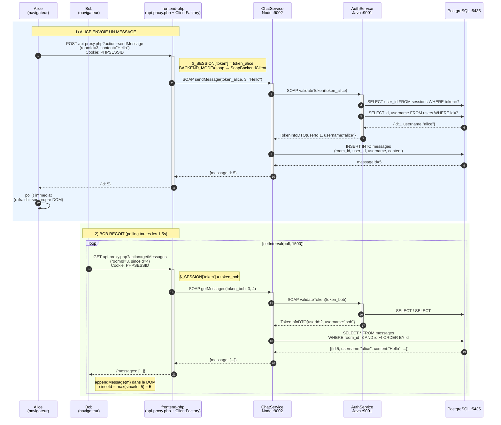
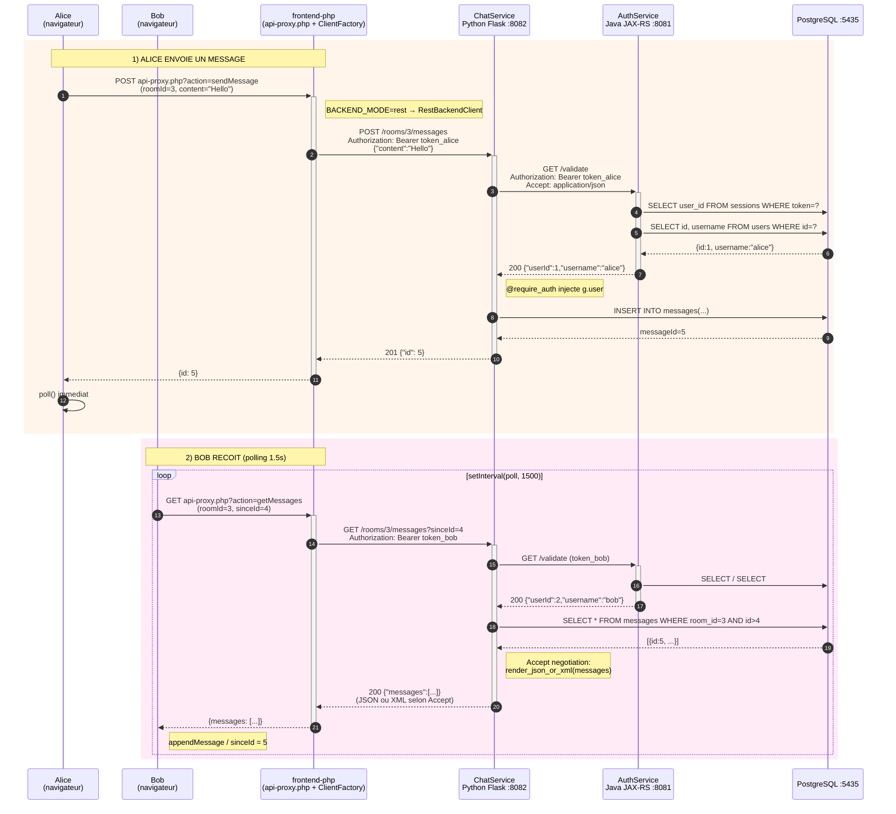

# Diagrammes de sequence — Chatroom SOAP + REST

Documente le **flux complet** d'envoi et de reception d'un message, depuis la saisie d'Alice jusqu'a l'affichage chez Bob, dans les deux phases du projet.

Les diagrammes sont au format **Mermaid** — affiches automatiquement sur GitHub, dans IntelliJ avec le plugin Mermaid, ou collables sur [mermaid.live](https://mermaid.live).

---

## Phase 1 — SOAP

---

## Phase 2 — REST

---

## Acteurs et stack

| # | Acteur | Role | Stack |
|---|---|---|---|
| 1 | **Alice / Bob** | Navigateur (HTML + JS polling 1.5 s) | `chat.js` |
| 2 | **frontend-php** | Pattern Port + 2 Adapters | `api-proxy.php` + `ClientFactory` + `SoapBackendClient` / `RestBackendClient` |
| 3 | **ChatService** | Microservice metier (rooms + messages) | Phase SOAP: Node.js + node-soap :9002 — Phase REST: Python Flask + xmltodict :8082 |
| 4 | **AuthService** | Microservice identite (users + sessions) | Phase SOAP: Java JAX-WS Metro :9001 — Phase REST: Java JAX-RS Jersey+Grizzly :8081 |
| 5 | **PostgreSQL** | Persistance | Docker :5435 — 4 bases isolees par phase |

## Points cles pedagogiques

1. **Le navigateur ne parle jamais SOAP ni REST en direct** : tout passe par `api-proxy.php`, qui est l'unique client des services. Le browser ne voit que JSON local.

2. **Pattern Port + Adapters** : `api-proxy.php` n'utilise que `ClientInterface`. La bascule SOAP ↔ REST se fait par variable d'environnement `BACKEND_MODE`, sans toucher au code applicatif.

3. **Composition de services obligatoire** : ChatService ne stocke pas de mot de passe. A **chaque** operation metier, il rappelle AuthService pour resoudre `(userId, username)` a partir du token. C'est ce qui donne du sens au TP — on demontre la composition de services distribues sous deux protocoles.

4. **Reception = polling, pas push** : Bob ne recoit pas le message en push. Sa boucle `setInterval(1500ms)` re-interroge le serveur. C'est le pattern de TP1 (polling toutes les 1 s en Java Swing) porte dans le navigateur. Latence max = 1.5 s.

5. **`sinceId` (BIGSERIAL monotone)** garantit qu'on ne recoit jamais deux fois le meme message et qu'on ne depend pas des horloges entre conteneurs/services.

6. **Content negotiation REST** : la reponse de ChatService Python varie selon `Accept: application/json` ou `application/xml`. Le frontend PHP demande toujours JSON (plus simple), mais on peut tester le XML directement en curl pour la demo.

## Differences entre les deux phases (resume)

| Aspect | Phase SOAP | Phase REST |
|---|---|---|
| Protocole | Enveloppes SOAP + WSDL | HTTP + JSON/XML |
| Transport token | Premier parametre de la methode | En-tete `Authorization: Bearer` |
| Format | XML structure | JSON par defaut, XML sur demande |
| ChatService | Node.js node-soap :9002 | Python Flask :8082 |
| AuthService | Java JAX-WS Metro :9001 | Java JAX-RS Jersey :8081 |
| Adapter PHP | `SoapClient` natif | `cURL` |
| Validation inter-service | `authClient.validateTokenAsync(token)` | `requests.get('/validate', headers={Authorization})` |
